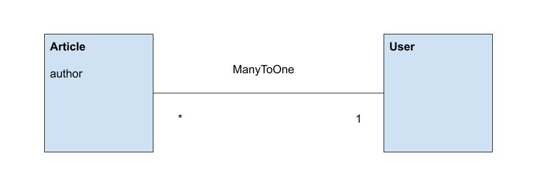
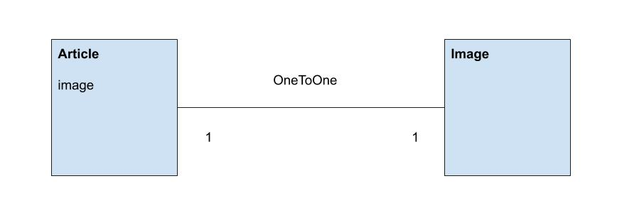

# Les relations

Les relations permettent de lier les entités entre-elle, par exemple un article peut être lié à une (ou plusieurs) catégories. Doctrine va créer des clés secondaires aux tables pour établir les relations.

## MANY TO ONE

Permet de lier plusieurs entrées d'une table à une entrée d'une autre table, par exemple un User peut être l'auteur de PLUSIEURS Article.



```php 
// src\Entity\Article.php

#[ORM\ManyToOne(inversedBy: 'articles')]
#[ORM\JoinColumn(onDelete: "SET NULL")]
private ?User $author = null;
```

```php
// src\Entity\User.php

#[ORM\OneToMany(mappedBy: 'author', targetEntity: Article::class)]
private Collection $articles;
```

Si nous essayons de supprimer un article qui a une relation avec un utilisateur, par défaut, la base de données va générer une erreur de contrainte, pour éviter ça il faut définir un comportement en cas de suppression en ajoutant un paramètre ``onDelete`` à "SET NULL".

## ONE TO ONE

