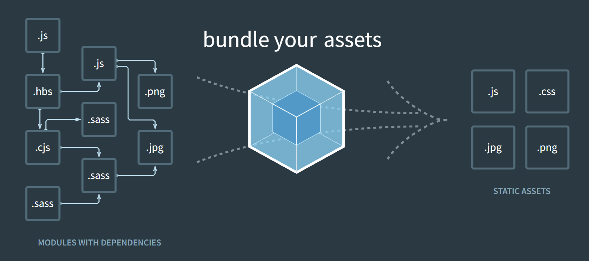

# Outils utilisés

Pour le fonctionnement de Symfony, ces diférents outils sont utiles

## Composer

Composer est un gestionnaire de bibliothèques PHP, vous pouvez les retrouver sur le site [Packagist.org](https://packagist.org/)
Tel un chef d'orchestre, Composer va installer les bibliothèques dont vous avez besoin ainsi que leurs dépendances avec les versions adaptés à votre environnement.

Les dépendances d'un projet sont décrites dans le fichier *composer.json*

Installer Composer pour Windows [ici](https://getcomposer.org/Composer-Setup.exe) (plus d'info sur le site)

## Symfony executable

Sensio Lab propose un outil pour créer simplement un projet Symfony: [installer Symfony](https://symfony.com/download)
Une fois installer vous devriez peut-être redémarrer votre machine

### Créer un nouveau projet Symfony

Ouvrir le terminal dans votre dossier web puis entrer cette commande en remplaçant "my_project_name"
par le nom de votre projet ``symfony new my_project_name --full``

> Une fois le projet créé ne pas oublier d'aller dans ce dossier depuis le terminal pour la suite de l'installation

## npm

npm est un gestionnaire de bibliothèques js et css, grâce à lui il est possible de mettre à jour toutes nos bibliothèques en une
seule ligne de commande (bootstrap, jquery, vue etc.)

npm est inclus dans node js [nodejs.org](https://nodejs.org/fr/)
Il est possible que le redémarrage de la machine soit nécessaire

### Installation de bootstrap

``npm install bootstrap --save-dev`` --save-dev indique que la librairie sera utilisée qu'en dev, elle seras compressée par webpack
pour la prod

## Webpack



Webpack va permettre de gérer les assets de notre application il permet par exemple de convertir des fichiers scss en css
simplement, de minier automatiquement les fichiers etc.

``composer require symfony/webpack-encore-bundle`` puis ``npm install`` pour installer les libs js/css

### Utiliser du scss

Pour permettre à webpack de convertir des fichiers scss en css il faut le configurer, ajouter cette ligne dans le fichier
*webpack.cong.js*

``.enableSassLoader()`` puis installer les libs js ``npm install sass-loader node-sass --save-dev``

Il reste à inclure bootstrap au fichier scss

```css
@import "node_modules/bootstrap/scss/bootstrap";
```
Installer jquery ``npm install jquery@~3.4.1 --save-dev`` puis Popper ``npm install popper.js --save-dev``

Pour générer les chiers naux dans public il faut appeler cette commande ``npm run dev``

## Flex

Flex est un plugin pour Composer qui va exécuter des recipes (recettes) an de congurer automatiquement les bibliothèques
ajoutées dans le projet Symfony.

